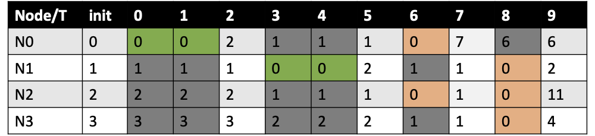
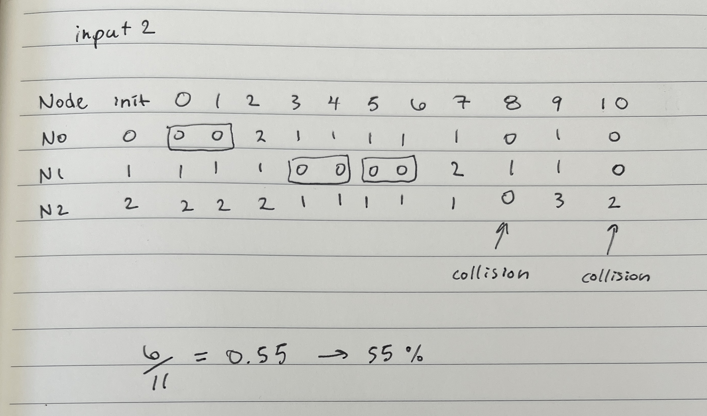
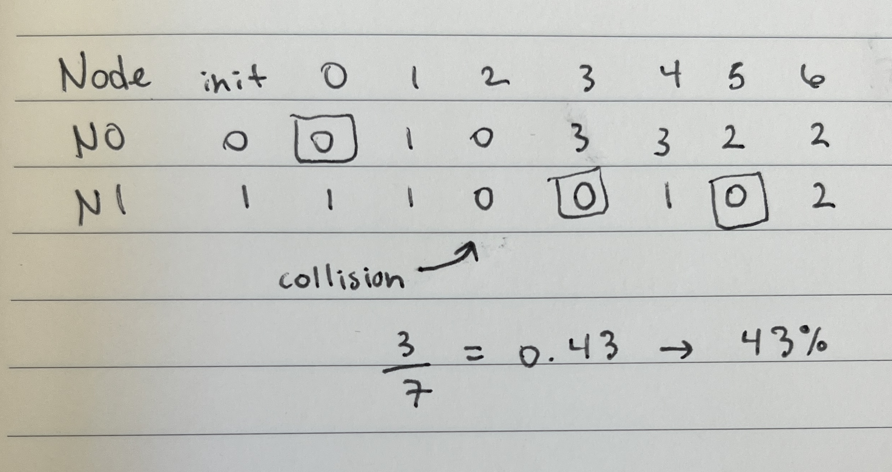
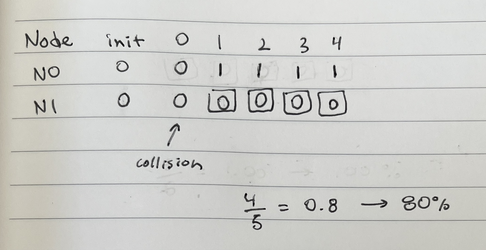
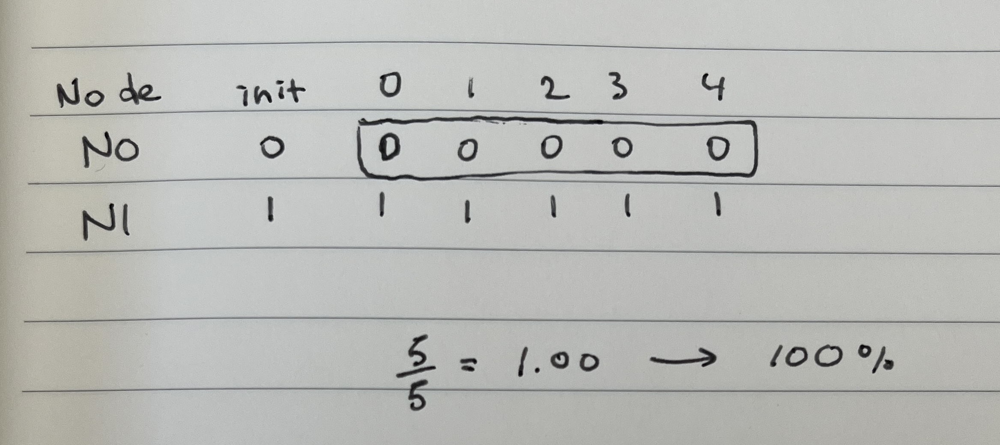

# Tests

## Test 1

Input:

```markdown
N 4
L 2
M 6
R 4 8 16 32 64 128
T 10
```

Result:


## Test 2

Input:

```markdown
N 3
L 2
M 3
R 3 4 5
T 11
```

Result:


## Test 3

Input:

```markdown
N 2
L 1
M 2
R 2 4
T 7
```

Result:


## Test 4

Input:

```markdown
N 2
L 1
M 2
R 1 2
T 5
```

Result:


## Test 5

Input:

```markdown
N 2
L 8
M 2
R 2 4
T 5
```

Result:

